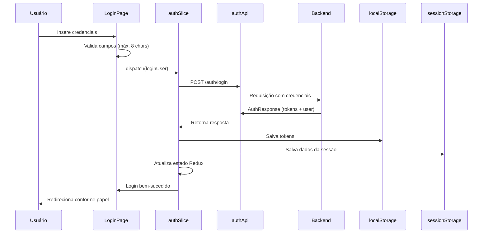

# 🔐 AUTH - Módulo de Autenticação e Autorização

**ID do módulo**: AUTH  
**Versão**: 1.0  
**Última atualização**: 2026-01-26  
**Propósito**: Gerenciar autenticação de usuários, autorização por papéis e segurança de sessões

---

## 📋 Visão geral

O módulo AUTH é o núcleo de segurança do sistema CardDemo. Entrega:
- Autenticação segura de usuários
- Gestão de sessão (tokens access/refresh)
- Autorização baseada em papéis (admin e back-office)
- Proteção de rotas sensíveis

### Responsabilidades principais
- ✅ Autenticação via credenciais
- ✅ Armazenamento seguro de tokens JWT
- ✅ Autorização por papéis
- ✅ Proteção de rotas (ProtectedRoute)
- ✅ Expiração automática da sessão
- ✅ Validação e renovação de tokens
- ✅ Logout limpo com remoção de dados

---

## 🏗️ Arquitetura do módulo

### Componentes-chave

#### 1. `authSlice.ts` - Gestão de estado no Redux
Local: `/app/features/auth/authSlice.ts`

**Responsabilidade**: Controlar o estado de autenticação em Redux

```typescript
interface AuthState {
  user: User | null;
  token: string | null;
  isAuthenticated: boolean;
  isLoading: boolean;
  error: string | null;
}
```

**Ações assíncronas**:
- `loginUser`
- `logoutUser`
- `refreshToken`
- `validateToken`

**Ações síncronas**:
- `clearError`
- `setCredentials`
- `clearCredentials`
- `immediateLogout`

#### 2. `authApi.ts` - Serviço de API
Local: `/app/services/authApi.ts`

**Responsabilidade**: Comunicação com o backend de autenticação

```typescript
POST /auth/login
POST /auth/logout
POST /auth/refresh
POST /auth/validate
GET  /auth/health
```

**Models principais**:
```typescript
interface AuthResponse {
  accessToken: string;
  refreshToken: string;
  tokenType: string;
  userId: string;
  fullName: string;
  userType: string; // 'A' = Admin, 'U' = Back-office
  expiresIn: number;
  message: string;
}

interface TokenValidationResponse {
  valid: boolean;
  userId?: string;
  message: string;
}
```

#### 3. `ProtectedRoute.tsx`
Local: `/app/components/auth/ProtectedRoute.tsx`

**Responsabilidade**: Proteger rotas conforme autenticação/papéis

Funcionalidades:
- Verifica autenticação
- Valida token ao carregar rota
- Controla acesso por papel
- Checa expiração de sessão
- Redireciona automaticamente

**Uso**:
```tsx
<ProtectedRoute requiredRole="admin">
  <AdminPage />
</ProtectedRoute>
```

#### 4. `useSecureSession`
Local: `/app/hooks/useSecureSession.ts`

**Responsabilidade**: Gerenciar sessão com validações automáticas

Funcionalidades:
- Verifica expiração (8h)
- Renova tokens a cada 5 min
- Limpa sessão ao fechar janela
- Observa visibilidade da aba
- Logout instantâneo na expiração

Métodos:
```typescript
{
  checkSessionExpiry: () => boolean;
  attemptTokenRefresh: () => Promise<boolean>;
  clearSession: () => void;
  performImmediateLogout: () => void;
}
```

#### 5. `LoginPage.tsx`
Local: `/app/pages/LoginPage.tsx`

**Responsabilidade**: Interface de login

Características:
- Formulário com validação
- Conversão automática para maiúsculas
- Máximo de 8 caracteres por campo
- Toggle de visualização de senha
- Mensagens de erro claras
- Redireciona conforme papel após login
- Mostra credenciais de exemplo
- Botão de acesso à documentação

---

## 🔗 APIs documentadas

### POST /auth/login
Autentica o usuário e retorna tokens

**Request**:
```json
{
  "userId": "ADMIN001",
  "password": "PASSWORD"
}
```

**Response (200)**:
```json
{
  "accessToken": "eyJhbGciOiJIUzI1NiIsInR5cCI6IkpXVCJ9...",
  "refreshToken": "mock-refresh-token-ADMIN001",
  "tokenType": "Bearer",
  "userId": "ADMIN001",
  "fullName": "Administrator User",
  "userType": "A",
  "expiresIn": 3600,
  "message": "Login successful"
}
```

**Erro (401)**:
```json
{
  "error": "Invalid credentials",
  "message": "User ID or password incorrect"
}
```

### POST /auth/logout
Encerra a sessão do usuário

**Request**: sem body (token no header)

**Response (200)**:
```json
{
  "message": "Logout successful"
}
```

### POST /auth/refresh
Renova o access token

**Request**:
```json
{
  "refreshToken": "mock-refresh-token-ADMIN001"
}
```

**Response (200)**:
```json
{
  "accessToken": "eyJhbGciOiJIUzI1NiIsInR5cCI6IkpXVCJ9..."
}
```

### POST /auth/validate
Valida o JWT atual

**Request**:
```json
{
  "token": "eyJhbGciOiJIUzI1NiIsInR5cCI6IkpXVCJ9..."
}
```

**Response (200)**:
```json
{
  "valid": true,
  "userId": "ADMIN001",
  "message": "Token is valid"
}
```

---

## 📊 Modelos de dados

### User
```typescript
interface User {
  id: number;
  userId: string;
  name: string;
  role: 'admin' | 'back-office';
  avatar: string;
  createdAt: string;
  isActive: boolean;
}
```

### LoginCredentials
```typescript
interface LoginCredentials {
  userId: string;   // até 8 caracteres, maiúsculo
  password: string; // até 8 caracteres, maiúsculo
}
```

### SessionData (sessionStorage)
```typescript
interface SessionData {
  userId: string;
  userType: string; // 'A' ou 'U'
  role: string;
  loginTime: number;
}
```

---

## 🔐 Regras de negócio

### Autenticação
1. **Credenciais**:
   - User ID e senha obrigatórios (máx. 8 caracteres)
   - Conversão automática para maiúsculas
   - Sem espaços em branco
2. **Papéis**:
   - `admin` (userType 'A'): acesso total
   - `back-office` (userType 'U'): acesso operacional
3. **Tokens**:
   - Access token válido por 1h
   - Refresh token dura toda a sessão
   - Armazenados em localStorage

### Sessão
1. **Duração**:
   - Máximo de 8 horas contínuas
   - Verificação a cada 5 minutos
   - Renovação automática se próximo de expirar
2. **Expiração**:
   - Logout após 8h
   - Validação ao trocar visibilidade da aba
   - Limpeza de sessionStorage ao fechar janela
3. **Segurança**:
   - Tokens apenas no localStorage
   - Dados temporários no sessionStorage
   - Logout limpa tudo
   - Token validado em cada rota protegida

### Autorização
1. **Controle de acesso**:
   - Rotas protegidas exigem autenticação
   - Algumas rotas exigem papel específico
   - Redirecionamentos:
     - Admin → `/menu/admin`
     - Back-office → `/menu/main`
2. **Proteção de rotas**:
   - Verificação de autenticação no carregamento
   - Validação de papel quando requerida
   - Redireciona ao login se não autenticado
   - Redireciona ao menu correto se papel diferente

---

## 🎯 Exemplos de User Stories

### 1. Login de usuário
```
Como usuário do sistema
Quero fazer login com minhas credenciais
Para acessar as funcionalidades do meu papel
```

**Critérios**:
- ✅ Formulário com User ID e senha
- ✅ Campos limitados a 8 caracteres
- ✅ Texto convertido automaticamente para maiúsculas
- ✅ Validação de preenchimento antes do envio
- ✅ Mensagem de erro para credenciais inválidas
- ✅ Redirecionamento conforme papel
- ✅ Tokens armazenados com segurança

**Complexidade**: Simples (1-2 pts)

---

### 2. Proteção de rotas
```
Como administrador
Quero rotas protegidas por papel
Para garantir acesso somente a usuários autorizados
```

**Critérios**:
- ✅ Autenticação obrigatória nas rotas
- ✅ Validação de papel quando necessário
- ✅ Redireciona usuários não autenticados ao login
- ✅ Redireciona usuários com papel diferente ao menu correto
- ✅ Mantém URL destino para redirecionar após login

**Complexidade**: Média (3 pts)

---

### 3. Gestão segura de sessão
```
Como usuário autenticado
Quero que a sessão expire após inatividade
Para proteger minha conta
```

**Critérios**:
- ✅ Sessão válida por até 8 horas
- ✅ Verificação a cada 5 minutos
- ✅ Renovação automática de tokens
- ✅ Logout automático ao expirar
- ✅ Limpeza ao fechar aba/janela
- ✅ Validação ao alternar visibilidade

**Complexidade**: Média (3-5 pts)

---

### 4. Renovação de token
```
Como sistema
Quero renovar tokens automaticamente
Para manter a sessão ativa sem interromper o usuário
```

**Critérios**:
- ✅ Renovação a cada 5 minutos
- ✅ Usa refresh token para obter novo access token
- ✅ Logout automático se renovação falhar
- ✅ Renovação transparente para o usuário
- ✅ Novo token substitui o antigo no localStorage

**Complexidade**: Média (3-5 pts)

---

## ⚡ Fatores de aceleração do desenvolvimento

### Componentes reutilizáveis
1. **ProtectedRoute**: protege qualquer rota rapidamente
2. **useSecureSession**: lógica completa de sessão segura
3. **authSlice**: slice do Redux com ações prontas
4. **authApi**: serviço com todos os endpoints configurados

### Padrões estabelecidos
1. **Redux Toolkit Pattern**: estrutura clara para adicionar ações
2. **API Client Pattern**: fácil incluir novos endpoints
3. **Hook Pattern**: base para criar novos hooks personalizados
4. **Protected Route Pattern**: modelo replicável para proteção

### Guias de complexidade
- **Simples (1-2 pts)**: adicionar validação de campo, alterar mensagem
- **Médio (3-5 pts)**: novo método de autenticação, ajustar fluxo de tokens
- **Complexo (5-8 pts)**: implementar MFA ou integrar SSO

---

## 📋 Dependências

### Internas
- **Store (Redux)**: estado global
- **Router**: navegação e proteção de rotas
- **API Client**: backend
- **Types**: interfaces compartilhadas (User, LoginCredentials etc.)

### Externas
- **@reduxjs/toolkit**: gerenciamento de estado
- **react-router-dom**: roteamento
- **@mui/material**: componentes da LoginPage

### Módulos dependentes de AUTH
- **Account**: precisa de autenticação
- **Credit Card**: autenticação + papel
- **Transaction**: autenticação obrigatória
- **User**: exige papel admin
- **Menu**: mostra opções conforme o papel
- **Bill Payment**: requer autenticação

---

## 🧪 Testes e mocks

### Handlers MSW
Local: `/app/mocks/authHandlers.ts`

**Usuários de teste**:
```typescript
// Admin
{ userId: "ADMIN001", password: "PASSWORD", role: "admin" }

// Back-office
{ userId: "USER001", password: "PASSWORD", role: "back-office" }
```

**Comportamento dos mocks**:
- Login retorna tokens válidos
- Logout sempre é bem-sucedido
- Refresh gera novo access token
- Validate verifica a estrutura do token

---

## 🚨 Considerações de segurança

### Boas práticas adotadas
1. **Armazenamento seguro**:
   - Tokens em localStorage
   - Dados temporários no sessionStorage
   - Limpeza completa no logout
2. **Validações**:
   - Token verificado em cada rota
   - Expiração de sessão conferida regularmente
   - Renovação automática dos tokens
3. **Proteções adicionais**:
   - Logout imediato se token inválido
   - Limpeza ao fechar janela
   - Verificação ao alterar visibilidade

### Melhorias futuras (dívida técnica)
1. Usar cookies HttpOnly para tokens
2. Implementar proteção CSRF
3. Limitar tentativas de login
4. Adotar autenticação em dois fatores
5. Pré-aprovação para autenticação biométrica em mobile

---

## 📈 Métricas de sucesso

### Funcionais
- ✅ 100% das rotas estão protegidas
- ✅ Sem acessos não autorizados detectados
- ✅ Logout automático funcionando em todos os fluxos

### Técnicas
- ⚡ Login em < 500ms
- ⚡ Validação de token em < 100ms
- ⚡ Renovação de token em < 300ms

### Negócio
- 📊 Taxa de login bem-sucedido > 98%
- 📊 Tempo médio de login < 5s
- 📊 Sessões ativas monitoradas via analytics

---

## 🔄 Fluxo completo de autenticação



---

**Última atualização**: 2026-01-26  
**Mantido por**: Equipe DS3A  
**Precisão do codebase**: 95%+
