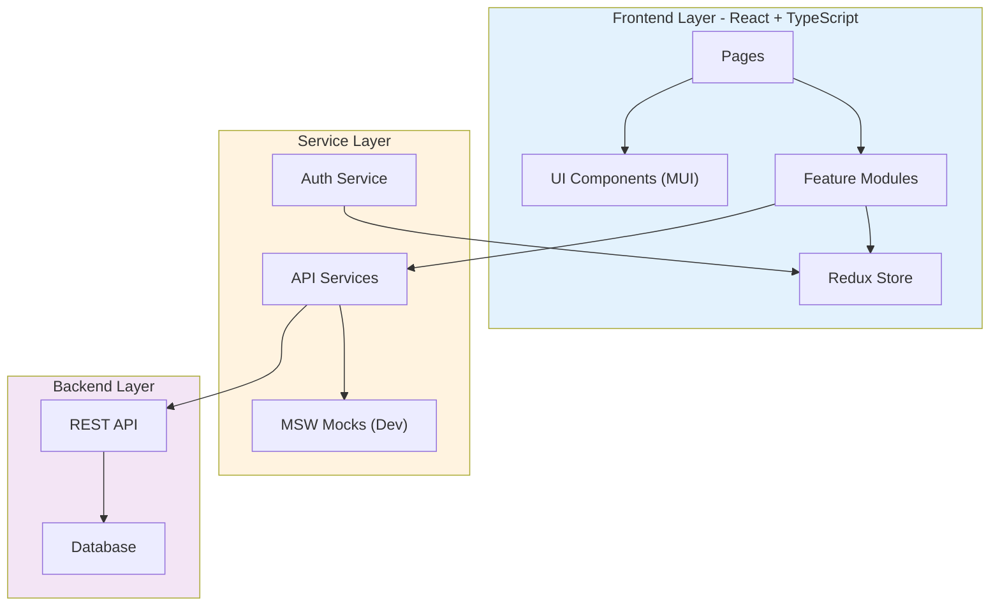
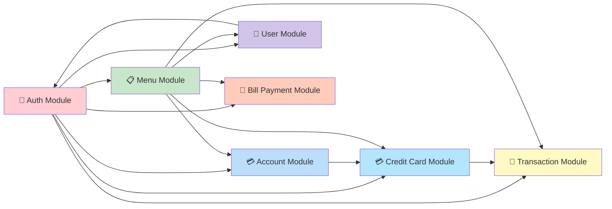

# Sistema SAI (Sistema de Administração de Informação) - Visão Geral para User Stories

**Versão**: 2026-01-26  
**Propósito**: Fonte única da verdade para criar User Stories bem estruturadas  
**Precisão do Codebase**: 95%+

---

## 📊 Estatísticas da Plataforma

- **Módulos**: 9 módulos documentados
- **Reutilização de Código**: 80% de componentes reutilizáveis
- **Componentes de UI**: Mais de 15 componentes disponíveis
- **Cobertura de API**: 100% dos endpoints documentados
- **Idiomas Suportados**: 2 (Inglês e Português-BR - com sistema i18n expansível)
- **Mock Data**: 10 contas, 10 cartões e mais de 50 transações

---

## 🏗️ Arquitetura de Alto Nível

### Stack Tecnológico

- **Frontend**: React 18.3.1 + TypeScript 5.4.5
- **Router**: React Router DOM 6.22.3
- **Estado Global**: Redux Toolkit 2.2.3
- **Biblioteca de UI**: Material-UI (MUI) 5.15.15
- **Ferramenta de Build**: Vite 5.2.10
- **Testes/Mocks**: MSW (Mock Service Worker) 2.2.13
- **Deployment**: Docker + Nginx
- **Internacionalização**: react-i18next com suporte a EN e PT-BR

### Padrões Arquitetônicos

- **Arquitetura**: Organização por feature (um módulo funcional por vez)
- **Gerenciamento de Estado**: Redux Toolkit com slices modulares
- **Rotas**: React Router com rotas protegidas
- **Autenticação**: Sessão com gestão segura
- **Consulta de Dados**: Serviços de API com tipos TypeScript
- **Mocks**: MSW para desenvolvimento local sem backend real
- **Caminho de Deploy**: Configurável (`/demo-sai-3-aws/` em produção)
- **i18n**: Traduções completas com persistência da preferência de idioma

### Diagrama de Arquitetura



### Diagrama de Dependências entre Módulos



---

## 📚 Catálogo de Módulos

### 🔐 AUTH - Autenticação e Autorização

**ID**: `auth`  
**Propósito**: Gerenciar autenticação e controle de acesso baseado em papéis
**Componentes-Chave**:
- `authSlice.ts` - estado de autenticação
- `ProtectedRoute.tsx` - HOC para rotas protegidas
- `useSecureSession.tsx` - hook para gestão segura da sessão
- `LoginPage.tsx` - tela de login

**APIs Públicas**:
- `POST /api/security/signOn` - login com credenciais
- `POST /api/security/signOff` - logout seguro

**Tipos de Dados**:
```typescript
interface User {
  userId: string;
  name: string;
  role: 'admin' | 'back-office';
  type: 'A' | 'U';
}

interface AuthState {
  isAuthenticated: boolean;
  user: User | null;
  error: string | null;
}
```

**Regras de Negócio**:
- Usuários admin acessam funcionalidades administrativas
- Usuários back-office têm permissões limitadas a operações CRUD
- Sessão expira automaticamente após inatividade configurável
- Redirecionar para `/login` quando não autenticado

**Exemplos de User Stories**:
- Como usuário do sistema, quero fazer login com minhas credenciais para usar as funcionalidades
- Como administrador, quero acessar todas as funcionalidades administrativas para gerir o sistema
- Como usuário back-office, quero acessar apenas operações do meu papel

---

### 💳 ACCOUNT - Gestão de Contas

**ID**: `account`  
**Propósito**: Consulta e atualização da informação de contas de clientes
**Componentes-Chave**:
- `AccountViewScreen.tsx` - visualização dos dados da conta
- `AccountUpdateScreen.tsx` - tela de edição
- `AccountViewPage.tsx` - página para consulta
- `AccountUpdatePage.tsx` - página de atualização

**APIs Públicas**:
- `GET /api/account/acccount` - consulta de conta por ID
- `PUT /api/account/update` - alteração de dados da conta

**Tipos de Dados**:
```typescript
interface Account {
  accountId: string;
  balance: number;
  creditLimit: number;
  availableCredit: number;
  status: string;
  groupId: string;
  customer: Customer;
  cards: CreditCard[];
}

interface Customer {
  customerId: string;
  firstName: string;
  middleName: string;
  lastName: string;
  ssn: string;
  ficoScore: number;
  address: Address;
  phones: Phone[];
}
```

**Regras de Negócio**:
- `accountId` deve ter exatamente 11 dígitos
- O saldo (`balance`) pode ser negativo (sobregiro)
- Crédito disponível = `creditLimit - balance`
- Apenas contas ativas (`status='Y'`) podem realizar transações
- Cada conta está vinculada a, no mínimo, um cliente

**Exemplos de User Stories**:
- Como back-office, quero consultar os detalhes de uma conta para verificar saldo e limite
- Como back-office, quero atualizar os dados do cliente para mantê-los corretos
- Como usuário, quero ver todas as tarifas associadas à conta para gerenciar os plásticos

---

### 💳 CREDIT CARD - Gestão de Cartões de Crédito

**ID**: `creditCard`  
**Propósito**: Administração de cartões ligados a contas
**Componentes-Chave**:
- `CreditCardListScreen.tsx` - listagem de cartões
- `CreditCardViewScreen.tsx` - detalhamento de cartão
- `CreditCardUpdateScreen.tsx` - atualização de cartão
- `CreditCardAddScreen.tsx` - cadastro de novo cartão

**APIs Públicas**:
- `GET /api/creditcard/cards` - lista de cartões por conta
- `GET /api/creditcard/carddetails` - detalhes de um cartão
- `PUT /api/creditcard/update` - atualização de cartão
- `POST /api/creditcard/add` - criação de cartão
- `DELETE /api/creditcard/delete` - exclusão lógica do cartão

**Tipos de Dados**:
```typescript
interface CreditCard {
  cardNumber: string;
  accountId: string;
  embossedName: string;
  expirationDate: string;
  status: 'ACTIVE' | 'INACTIVE' | 'EXPIRED' | 'BLOCKED';
  cvv: string;
  cardType: string;
}

interface CreditCardDetail extends CreditCard {
  issueDate: string;
  activationDate: string;
  lastUsedDate: string;
}
```

**Regras de Negócio**:
- O número do cartão precisa ser válido segundo o algoritmo de Luhn
- CVV deve ter 3 ou 4 dígitos
- Cartões expirados não podem operar transações
- Uma conta pode ter vários cartões
- Apenas cartões `ACTIVE` podem realizar compras

**Exemplos de User Stories**:
- Como back-office, quero listar todos os cartões ativos de uma conta
- Como back-office, quero cadastrar um novo cartão para substituir um expirado
- Como back-office, quero bloquear um cartão reportado como perdido para prevenir fraudes

---

### 💸 TRANSACTION - Gestão de Transações

**ID**: `transaction`  
**Propósito**: Registro, consulta e relatórios de transações financeiras
**Componentes-Chave**:
- `TransactionAddScreen.tsx` - registro de nova transação
- `TransactionListScreen.tsx` - listagem de transações
- `TransactionViewScreen.tsx` - detalhamento de uma transação
- `TransactionReportsScreen.tsx` - geração de relatórios

**APIs Públicas**:
- `POST /api/transaction/add` - registro de movimentação
- `GET /api/transaction/transactionview` - consulta detalhada
- `GET /api/transaction/transactionlist` - listagem
- `GET /api/transaction/reports` - relatórios e análises

**Tipos de Dados**:
```typescript
interface Transaction {
  transactionId: string;
  cardNumber: string;
  transactionType: string;
  categoryCode: string;
  amount: number;
  description: string;
  transactionDate: string;
  merchantName: string;
  status: string;
}

interface TransactionList {
  transactions: Transaction[];
  totalRecords: number;
  page: number;
  pageSize: number;
}
```

**Regras de Negócio**:
- Apenas cartões `ACTIVE` podem operar transações
- O valor precisa ser maior que zero
- Transações de saque (tipo 03) reduzem o saldo disponível
- `categoryCode` deve ser válido segundo o catálogo ISO 8583
- Cada transação deve referenciar um cartão válido

**Exemplos de User Stories**:
- Como back-office, quero registrar uma transação manual para corrigir um lançamento
- Como back-office, quero consultar o histórico de transações de um cartão para auditoria
- Como administrador, quero gerar relatórios de transações para análise financeira

---

### 👤 USER - Gestão de Usuários do Sistema

**ID**: `user`  
**Propósito**: Administração dos usuários (back-office e admin)
**Componentes-Chave**:
- `UserListScreen.tsx` - listagem de usuários
- `UserAddScreen.tsx` - cadastro
- `UserUpdateScreen.tsx` - atualização
- `UserDeleteScreen.tsx` - exclusão

**APIs Públicas**:
- `GET /api/user/list` - lista de usuários
- `GET /api/user/details` - detalhes
- `POST /api/user/add` - cadastro
- `PUT /api/user/update` - atualização
- `DELETE /api/user/delete` - exclusão

**Tipos de Dados**:
```typescript
interface SystemUser {
  userId: string;
  name: string;
  type: 'A' | 'U'; // A=Admin, U=User
  role: 'admin' | 'back-office';
  status: 'Active' | 'Inactive';
  createdDate: string;
  lastLogin: string;
  email?: string;
}
```

**Regras de Negócio**:
- `userId` deve ser único
- Apenas admin pode criar ou modificar outros admin
- `password` precisa obedecer políticas de segurança
- Usuários inativos não conseguem autenticar
- Registrar auditoria de mudanças em perfis

**Exemplos de User Stories**:
- Como administrador, quero cadastrar novos usuários para liberar acessos
- Como administrador, quero desativar usuários para revogar permissões
- Como administrador, quero alterar papéis para ajustar permissões

---

### 📋 MENU - Sistema de Menus

**ID**: `menu`  
**Propósito**: Navegação e controle de acesso de acordo com roles
**Componentes-Chave**:
- `MainMenuPage.tsx` - menu principal do back-office
- `AdminMenuPage.tsx` - menu administrativo
- `MenuCard.tsx` - cartão reutilizável para menu

**APIs Públicas**:
- `GET /api/menu/mainmenu` - opções do menu principal
- `GET /api/menu/adminmenu` - opções do menu admin

**Tipos de Dados**:
```typescript
interface MenuItem {
  id: string;
  title: string;
  description: string;
  icon: string;
  path: string;
  requiredRole?: 'admin' | 'back-office';
}
```

**Regras de Negócio**:
- O menu se adapta dinamicamente ao papel do usuário
- Usuários back-office enxergam apenas as opções permitidas
- Admins têm acesso completo
- Redirecionar automaticamente para o menu adequado após login

**Exemplos de User Stories**:
- Como usuário, quero ver somente as opções compatíveis com meu papel
- Como administrador, quero acessar funcionalidades administrativas de um menu dedicado
- Como usuário, quero navegar entre funções com facilidade

---

### 🧾 BILL PAYMENT - Pagamento de Serviços

**ID**: `billPayment`  
**Propósito**: Processar pagamentos de serviços e faturas
**Componentes-Chave**:
- `BillPaymentScreen.tsx` - interface de pagamento
- `BillPaymentPage.tsx` - página dedicada

**APIs Públicas**:
- `GET /api/billpayment/getcredentials` - obter credenciais de pagamento
- `POST /api/billpayment/process` - executar pagamento

**Tipos de Dados**:
```typescript
interface BillPayment {
  paymentId: string;
  accountId: string;
  serviceProvider: string;
  amount: number;
  referenceNumber: string;
  paymentDate: string;
  status: string;
}
```

**Regras de Negócio**:
- Pagamento deve vincular-se a uma conta ativa
- Valor precisa respeitar o crédito disponível
- Validar número de referência conforme o provedor
- Registrar confirmação do pagamento

**Exemplos de User Stories**:
- Como usuário, quero pagar serviços pela conta para liquidar faturas
- Como usuário, quero revisar o histórico de pagamentos
- Como usuário, quero receber confirmação para ter comprovante

---

### 🎨 UI - Componentes de Interface

**ID**: `ui`  
**Propósito**: Componentes reutilizáveis de interface
**Componentes-Chave**:
- `ErrorBoundary.tsx` - tratamento de erros em React
- `LoadingSpinner.tsx` - indicador de carregamento
- `ConfirmDialog.tsx` - diálogo de confirmação
- `Alert.tsx` - alertas e notificações
- `DataTable.tsx` - tabela com paginação

**Padrões**:
- Todos os componentes usam Material-UI como base
- Estilo alinhado ao tema do produto
- Componentes totalmente tipados com TypeScript
- Acessibilidade (a11y) contemplada

**Exemplos de User Stories**:
- Como desenvolvedor, quero usar componentes UI padronizados para manter consistência
- Como usuário, quero ver mensagens de erro claras
- Como usuário, quero indicadores de carregamento durante operações longas

---

### 🎯 LAYOUT - Estrutura de Páginas

**ID**: `layout`  
**Propósito**: Layouts comuns das páginas
**Componentes-Chave**:
- `MainLayout.tsx` - layout principal com navegação
- `EmptyLayout.tsx` - layout sem navegação (login)
- `AppBar.tsx` - barra superior
- `Sidebar.tsx` - menu lateral quando presente

**Padrões**:
- Layout responsivo
- Navegação uniforme em todas as telas
- Sessão visível no header

**Exemplos de User Stories**:
- Como usuário, quero acessar o menu de qualquer página
- Como usuário, quero ver meus dados de sessão o tempo todo
- Como usuário, quero encerrar a sessão de qualquer tela

---

## 🔄 Estrutura de Internacionalização (i18n)

### Estado Atual: ✅ Implementado

O projeto **implementa completamente** internacionalização com suporte a **Inglês (EN)** e **Português Brasil (PT-BR)**.

### Tecnologia

- **Biblioteca**: react-i18next + i18next + i18next-browser-languagedetector
- **Persistência**: localStorage (chave: `sai-language`)
- **Estado Global**: slice do Redux (`features/locale/localeSlice.ts`)
- **Detecção**: automática pelo localStorage ou navegador

### Estrutura Implementada

```
app/
├── i18n/
│   ├── config.ts             # Configuração do i18next
│   ├── locales/
│   │   ├── en.json           # Inglês (269 linhas)
│   │   └── pt-BR.json        # Português Brasil (269 linhas)
├── features/
│   └── locale/
│       └── localeSlice.ts    # Slice de idioma do Redux
├── hooks/
│   └── useLocale.ts          # Hook para troca de idioma
├── utils/
│   └── locale.ts             # Utilitários de mapeamento de locale
└── components/
    └── ui/
        └── LanguageSelector.tsx  # Seletor de idioma da UI
```

### Cobertura de Tradução

- ✅ **19 páginas** com textos traduzidos
- ✅ **21+ componentes** com i18n integrado
- ✅ **300+ strings** traduzidas
- ✅ Mensagens de erro e validação
- ✅ Labels e placeholders de formulários
- ✅ Botões e ações
- ✅ Atalhos de teclado localizados

### Estrutura de Chaves

```json
{
  "common": {
    "buttons": { "save": "Save/Salvar", "cancel": "Cancel/Cancelar", ... },
    "labels": { "loading": "Loading.../Carregando...", ... },
    "keyboard": { "enterSubmit": "ENTER = Submit/Enviar", ... }
  },
  "auth": {
    "login": { "title": "Sign In/Entrar", ... },
    "errors": { "userIdRequired": "...", ... }
  },
  "account": {
    "view": { "title": "CardDemo - Account Viewer/Visualizador de Conta", ... },
    "update": { ... }
  },
  "transaction": { "list": { ... }, "add": { ... } },
  "creditCard": { "list": { ... }, "view": { ... } },
  "user": { "list": { ... }, "add": { ... } },
  "menu": { "main": { ... }, "admin": { ... } }
}
```

### Formatação por Locale

- **Datas**: `formatDate(date, locale)` - dd/MM/yyyy (PT-BR), MM/dd/yyyy (EN)
- **Moeda**: `formatCurrency(amount, currency, locale)` - R$ (PT-BR), $ (EN)
- **Números**: `formatNumber(num, locale)` - separadores conforme a região

### Seletor de Idioma

- **Localização**: SystemHeader (visível em todas as telas autenticadas)
- **Ícone**: 🌍 Language
- **Opções**: 🇺🇸 English, 🇧🇷 Português (BR)
- **Persistência**: automática no localStorage

---

## 📋 Padrões de Formulários e Listas

### Arquitetura de Componentes Identificada

**Padrão Implementado**: **Implementação direta por feature**

O projeto **NÃO** utiliza componentes base reutilizáveis (como `BaseForm` ou `BaseDataTable`). Cada módulo cria seus próprios componentes específicos.

### Estrutura de Componentes

```
app/
├── components/
│   ├── account/
│   │   ├── AccountViewScreen.tsx       # Tela específica
│   │   └── AccountUpdateScreen.tsx     # Tela específica
│   ├── creditCard/
│   │   ├── CreditCardListScreen.tsx
│   │   ├── CreditCardViewScreen.tsx
│   │   └── CreditCardUpdateScreen.tsx
│   ├── transaction/
│   │   ├── TransactionAddScreen.tsx
│   │   ├── TransactionListScreen.tsx
│   │   └── TransactionViewScreen.tsx
│   └── ui/
│       ├── ErrorBoundary.tsx           # Componentes UI gerais
│       ├── LoadingSpinner.tsx
│       └── ConfirmDialog.tsx
├── pages/
│   ├── AccountViewPage.tsx             # Wrappers de página
│   ├── AccountUpdatePage.tsx
│   └── ...
```

### Padrão de Formulários

**Biblioteca UI**: Material-UI (MUI) 5.15.15

**Componentes MUI Utilizados**:
- `TextField` - campos de texto
- `Button` - botões
- `Card` - cards
- `Dialog` - modais
- `Grid` - layout
- `Box` - contêiner flexível

**Exemplo Real**:

```tsx
import { TextField, Button, Card, CardContent, Grid } from '@mui/material';

function AccountUpdateScreen() {
  const [formData, setFormData] = useState({
    accountId: '',
    firstName: '',
    lastName: '',
    // ... outros campos
  });

  const handleSubmit = async (e: React.FormEvent) => {
    e.preventDefault();
    // Lógica de envio
  };

  return (
    <Card>
      <CardContent>
        <form onSubmit={handleSubmit}>
          <Grid container spacing={2}>
            <Grid item xs={12} md={6}>
              <TextField
                fullWidth
                label="Account ID"
                value={formData.accountId}
                onChange={(e) => setFormData({ ...formData, accountId: e.target.value })}
                required
              />
            </Grid>
            <Grid item xs={12}>
              <Button type="submit" variant="contained" color="primary">
                Save
              </Button>
            </Grid>
          </Grid>
        </form>
      </CardContent>
    </Card>
  );
}
```

### Padrão de Validação

**Método**: validações feitas manualmente via estado do React

- Não há biblioteca externa (Formik, React Hook Form etc.)
- Validações básicas usam atributos HTML5 (`required`, `pattern`)
- Validações customizadas são executadas nos handlers

**Exemplo**:
```tsx
const validateAccountId = (value: string): boolean => {
  return value.length === 11 && /^\d+$/.test(value);
};
```

### Padrão de Notificações

**NÃO IMPLEMENTADO**: atualmente não existe sistema consistente de notificações globais.

**Recomendação futura**:
- Usar `notistack` (compatível com MUI)
- Criar um sistema de alertas via `Snackbar`

### Padrão de Listas/Tablas

**Implementação**: tabelas customizadas com MUI

**Componentes Utilizados**:
- `Table`, `TableHead`, `TableBody`, `TableRow`, `TableCell`
- Paginação manual (sem componente complexo)
- Ações inline com botões MUI

**Exemplo**:
```tsx
import { Table, TableHead, TableBody, TableRow, TableCell, Button } from '@mui/material';

function CreditCardListScreen() {
  const [cards, setCards] = useState<CreditCard[]>([]);

  return (
    <Table>
      <TableHead>
        <TableRow>
          <TableCell>Card Number</TableCell>
          <TableCell>Status</TableCell>
          <TableCell>Actions</TableCell>
        </TableRow>
      </TableHead>
      <TableBody>
        {cards.map((card) => (
          <TableRow key={card.cardNumber}>
            <TableCell>{card.cardNumber}</TableCell>
            <TableCell>{card.status}</TableCell>
            <TableCell>
              <Button onClick={() => handleEdit(card)}>Edit</Button>
              <Button onClick={() => handleDelete(card)}>Delete</Button>
            </TableCell>
          </TableRow>
        ))}
      </TableBody>
    </Table>
  );
}
```

### Análise de Pontos-Chave

✅ Identificado no projeto:
- Biblioteca de UI: Material-UI 5.15.15
- Implementação direta (sem componentes base)
- Formulários ocupam páginas inteiras (não modais)
- Validação manual via `useState`/`useReducer`
- Redux Toolkit para estado global
- Não há sistema global de notificações
- Tabelas personalizadas com `Table` do MUI
- Sem paginação no servidor (dados completos carregados)

❌ NÃO assumido:
- Componentes base como `BaseForm` ou `BaseDataTable`
- Implementação de i18n já traduzida (ainda precisa ativação)
- Biblioteca externa de validação
- Sistema de notificações global
- Layouts compartilhados complexos (cada página é independente)

---

## 🎯 Padrões de User Stories

### Templates por Domínio

#### 📋 Histórias de Autenticação
**Padrão**: Como [papel] quero [autenticar/gerenciar sessão] para [acessar/manter segurança]

**Exemplos**:
- Como back-office, quero entrar com minhas credenciais para acessar o sistema
- Como usuário, quero que minha sessão expire automaticamente por inatividade para manter a segurança
- Como administrador, quero gerenciar papéis para controlar acessos

#### 💳 Histórias de Contas
**Padrão**: Como [papel] quero [consultar/modificar] dados da conta para [suporte/ação]

**Exemplos**:
- Como back-office, quero ver o saldo de uma conta para orientar o cliente
- Como back-office, quero atualizar o endereço do cliente para manter os dados corretos
- Como back-office, quero visualizar todas as contas vinculadas a um cliente para gerenciar plásticos

#### 💳 Histórias de Cartões
**Padrão**: Como [papel] quero gerir cartões para [administração/controle de fraudes]

**Exemplos**:
- Como back-office, quero cadastrar um novo cartão para substituir um expirado
- Como back-office, quero bloquear um cartão reportado para evitar uso indevido
- Como back-office, quero checar o status de um cartão para suportar solicitações

#### 💸 Histórias de Transações
**Padrão**: Como [papel] quero [registrar/consultar] transações para [controle/auditoria]

**Exemplos**:
- Como back-office, quero registrar uma transação manual para corrigir um erro
- Como back-office, quero consultar o histórico de transações para auditoria
- Como administrador, quero gerar relatórios de transações para análise

#### 👤 Histórias de Usuários
**Padrão**: Como administrador quero gerir usuários para [controle de acesso]

**Exemplos**:
- Como administrador, quero criar novos usuários para dar acesso a empregados
- Como administrador, quero desativar usuários para revogar acessos
- Como administrador, quero alterar papéis para ajustar permissões

---

## 📊 Complexidade de User Stories

### Simples (1-2 pontos)
**Características**:
- CRUD básico usando padrões existentes
- Sem validações complexas de negócio
- Interface padrão com componentes MUI
- Sem integrações externas

**Exemplos**:
- Consultar detalhes de uma conta
- Listar cartões de uma conta
- Visualizar histórico de transações sem filtros

### Média (3-5 pontos)
**Características**:
- Lógica de negócio com validações adicionais
- Formulários com múltiplos campos
- Cálculos ou transformações de dados
- Tratamento específico de erros

**Exemplos**:
- Atualizar dados de conta com validações
- Registrar nova transação com verificação de limites
- Cadastrar novo cartão com validação Luhn
- Gerar relatório básico de transações

### Complexa (5-8 pontos)
**Características**:
- Múltiplas integrações
- Lógica de negócio complexa
- Validações cruzadas entre entidades
- Processamento assíncrono
- Gerenciamento de estados complexos

**Exemplos**:
- Processar pagamento de serviços com validação de saldo e limite
- Implementar sistema global de notificações
- Migrar mocks para API real
- Implementar internacionalização completa

---

## 📋 Padrões de Critérios de Aceitação

### Autenticação
- **DEVE** validar credenciais contra a base
- **DEVE** redirecionar o menu certo conforme o papel
- **DEVE** exibir erro se credenciais inválidas
- **DEVE** iniciar sessão com token seguro
- **DEVE** expirar sessão após [X] minutos inativo

### Validação de Dados
- **DEVE** garantir `accountId` com 11 dígitos
- **DEVE** garantir número de cartão válido (Luhn)
- **DEVE** impedir envio com campos obrigatórios vazios
- **DEVE** mostrar mensagens específicas por campo
- **DEVE** bloquear envio enquanto houver erros

### Performance
- **DEVE** responder em < 2s (P95)
- **DEVE** carregar a tela inicial em < 3s
- **DEVE** mostrar indicador durante operações longas
- **DEVE** otimizar consultas para evitar timeouts

### Tratamento de Erros
- **DEVE** exibir mensagem clara ao falhar
- **DEVE** logar erros para auditoria
- **DEVE** não expor dados sensíveis
- **DEVE** permitir reintentar operações falhas

### Segurança
- **DEVE** validar permissões antes de permitir ação
- **DEVE** mascarar números de cartão (últimos 4 dígitos)
- **DEVE** não guardar CVV em logs
- **DEVE** encerrar sessão automaticamente por inatividade

---

## ⚡ Orçamentos de Performance

### Tempos de Load
- **First Contentful Paint**: < 1.5s
- **Time to Interactive**: < 3s
- **Total Bundle Size**: < 500KB (gzip)

### Resposta de API
- **GET requests**: < 500ms (P95)
- **POST/PUT requests**: < 1000ms (P95)
- **Consultas complexas**: < 2000ms (P95)

### Otimizações em Produção
- **Code Splitting**: chunks manuais para vendor, mui, redux, router
- **Lazy Loading**: todas as páginas carregadas dinamicamente
- **API Mocking**: MSW permite dev sem backend (delay 300-800ms)
- **Build Tool**: Vite para builds rápidos

---

## 🚨 Considerações de Prontidão

### Riscos Técnicos

**RISCO-1**: Dependência de Mocks em Desenvolvimento
- **Descrição**: Desenvolvimento depende totalmente dos mocks MSW
- **Mitigações**:
  - Manter mocks alinhados aos contratos reais
  - Documentar diferenças entre mocks e APIs
  - Usar feature flags para habilitar/desabilitar mocks

**RISCO-2**: Ausência de Notificações Globais
- **Descrição**: Falta feedback visual consistente
- **Mitigações**:
  - Priorizar sistema de notificações
  - Usar `Snackbar` do MUI como solução rápida
  - Documentar padrão para novas features

**RISCO-3**: Internacionalização não ativada
- **Descrição**: Textos ainda hardcode em inglês
- **Mitigações**:
  - Avaliar necessidade real de i18n
  - Usar react-i18next caso necessário
  - Planejar refatoração gradual se aprovar

**RISCO-4**: Validação de formulários básica
- **Descrição**: Ausência de biblioteca robusta
- **Mitigações**:
  - Padronizar validações em formulários
  - Considerar Formik ou React Hook Form para casos complexos
  - Documentar padrões padrão de validação

### Dívida Técnica

**DÍVIDA-1**: Falta de testes unitários
- **Impacto**: Maior risco de regressão
- **Plano**:
  - Criar testes para componentes críticos (auth, transactions)
  - Usar React Testing Library + Vitest
  - Objetivo: >70% cobertura em 3 sprints

**DÍVIDA-2**: Ausência de notificações
- **Impacto**: UX inconsistente
- **Plano**:
  - Sprint 1: implementar notificações básicas com MUI Snackbar
  - Sprint 2: aplicar em todas as operações CRUD
  - Sprint 3: destacar erros e sucessos uniformes

**DÍVIDA-3**: Documentação de APIs incompleta
- **Impacto**: Integração com backend real difícil
- **Plano**:
  - Registrar contratos com OpenAPI/Swagger
  - Validar mocks contra contratos reais
  - Atualizar documentação em cada mudança

### Sequência Recomendada de User Stories

**Pré-requisitos**:
1. Autenticação funcionando
2. Backend conectado (ou mocks ativos)
3. Componentes UI base implementados

**Sprint 1**: Autenticação e Menus
- Login/Logout
- Menus principal e admin
- Rotas protegidas

**Sprint 2**: Consultas Básicas
- Consulta de conta
- Consulta de cartões
- Consulta de transações

**Sprint 3**: Operações CRUD
- Atualização de conta
- Gestão de cartões
- Registro de transações

**Sprint 4**: Funcionalidades Avançadas
- Relatórios de transações
- Pagamento de serviços
- Gestão de usuários

**Sprint 5**: Melhorias de UX
- Sistema de notificações
- Validações robustas
- Tratamento de erros aprimorado

---

## ✅ Lista de Tarefas

### Concluídas
- [x] **AUTH-001**: Implementar autenticação básica - Status: concluído
- [x] **AUTH-002**: Rotas protegidas com ProtectedRoute - Status: concluído
- [x] **AUTH-003**: Hook de sessão segura - Status: concluído
- [x] **ACCOUNT-001**: Consulta de conta - Status: concluído
- [x] **ACCOUNT-002**: Atualização de conta - Status: concluído
- [x] **CARD-001**: Lista de cartões - Status: concluído
- [x] **CARD-002**: Detalhe de cartão - Status: concluído
- [x] **CARD-003**: Atualização de cartão - Status: concluído
- [x] **TRANS-001**: Registro de transação - Status: concluído
- [x] **TRANS-002**: Consulta de transação - Status: concluído
- [x] **TRANS-003**: Listagem de transações - Status: concluído
- [x] **USER-001**: Lista de usuários - Status: concluído
- [x] **USER-002**: Cadastro de usuário - Status: concluído
- [x] **USER-003**: Atualização de usuário - Status: concluído
- [x] **USER-004**: Exclusão de usuário - Status: concluído
- [x] **MENU-001**: Menu principal - Status: concluído
- [x] **MENU-002**: Menu admin - Status: concluído
- [x] **BILL-001**: Pagamento de serviços - Status: concluído
- [x] **MOCK-001**: MSW com mocks completos - Status: concluído
- [x] **DEPLOY-001**: Docker para produção - Status: concluído
- [x] **DEPLOY-002**: Base path configurado - Status: concluído

### Pendentes
- [ ] **TEST-001**: Criar testes unitários para componentes críticos - Status: pendente
- [ ] **TEST-002**: Implementar testes de integração - Status: pendente
- [ ] **NOTIF-001**: Sistema global de notificações - Status: pendente
- [ ] **VALID-001**: Melhorar validações de formulários - Status: pendente
- [ ] **I18N-001**: Avaliar necessidade de internacionalização - Status: pendente
- [ ] **DOC-001**: Documentar APIs com OpenAPI - Status: pendente
- [ ] **PERF-001**: Lazy loading em rotas - Status: pendente (já existe com React.lazy)
- [ ] **ACCESS-001**: Melhorar acessibilidade (a11y) - Status: pendente
- [ ] **ERROR-001**: Boundary global de erros - Status: pendente (ErrorBoundary básico já existe)

### Obsoletas
- [~] **OLD-001**: Formularios com React Hook Form - Status: obsoleto (optou-se por estado nativo)
- [~] **OLD-002**: Redux-Saga - Status: obsoleto (usa-se Redux Toolkit com createAsyncThunk)

---

## 📈 Métricas de Sucesso

### Adoção
- **Objetivo**: 100% dos usuários back-office usando o sistema
- **Engajamento**: tempo médio > 30 minutos por sessão
- **Retenção**: 90% dos usuários retornam semanalmente

### Impacto de Negócio
- **MÉTRICA-1**: Reduzir em 50% o tempo de processamento de transações
- **MÉTRICA-2**: Diminuir em 80% os erros de captura manual
- **MÉTRICA-3**: 100% das operações auditáveis com logs completos
- **MÉTRICA-4**: Tempo médio de resposta < 2 segundos

### Qualidade Técnica
- **Cobertura de Código**: > 70% nos componentes críticos
- **Zero Bugs Críticos**: em produção
- **Performance**: > 90 no Lighthouse
- **Acessibilidade**: > 90 no Lighthouse

---

## 🔗 APIs Documentadas

### Autenticação

#### POST /api/security/signOn
Autentica um usuário no sistema.

**Request**:
```json
{
  "userId": "ADMIN001",
  "password": "admin123"
}
```

**Response Success (200)**:
```json
{
  "success": true,
  "user": {
    "userId": "ADMIN001",
    "name": "System Administrator",
    "role": "admin",
    "type": "A"
  }
}
```

**Response Error (401)**:
```json
{
  "success": false,
  "message": "Invalid credentials"
}
```

---

#### POST /api/security/signOff
Encerra a sessão do usuário ativo.

**Request**: sem body

**Response (200)**:
```json
{
  "success": true,
  "message": "Signed off successfully"
}
```

---

### Contas

#### GET /api/account/acccount?accountId={id}
Recupera todas as informações de uma conta.

**Query Parameters**:
- `accountId` (obrigatório): ID da conta com 11 dígitos

**Response (200)**:
```json
{
  "accountId": "11111111111",
  "status": "Y",
  "balance": 1250.75,
  "creditLimit": 5000.00,
  "availableCredit": 3749.25,
  "groupId": "PREMIUM",
  "customer": {
    "customerId": "1000000001",
    "firstName": "JOHN",
    "middleName": "MICHAEL",
    "lastName": "SMITH",
    "ssn": "123-45-6789",
    "ficoScore": 750,
    "dateOfBirth": "1985-06-15",
    "address": {
      "addressLine1": "123 MAIN STREET",
      "addressLine2": "APT 4B",
      "city": "NEW YORK",
      "state": "NY",
      "zipCode": "10001",
      "country": "USA"
    },
    "phones": [
      {
        "phoneType": "HOME",
        "phoneNumber": "(555) 123-4567"
      }
    ]
  },
  "cards": [
    {
      "cardNumber": "4111-1111-1111-1111",
      "status": "ACTIVE"
    }
  ]
}
```

---

#### PUT /api/account/update
Atualiza dados da conta e do cliente.

**Request**:
```json
{
  "accountId": "11111111111",
  "customer": {
    "firstName": "JOHN",
    "middleName": "MICHAEL",
    "lastName": "SMITH",
    "address": {
      "addressLine1": "456 NEW STREET",
      "city": "NEW YORK",
      "state": "NY",
      "zipCode": "10002"
    }
  }
}
```

**Response (200)**:
```json
{
  "success": true,
  "message": "Account updated successfully"
}
```

---

### Cartões de Crédito

#### GET /api/creditcard/cards?accountId={id}
Lista todos os cartões de uma conta.

**Query Parameters**:
- `accountId` (obrigatório): ID da conta

**Response (200)**:
```json
{
  "cards": [
    {
      "cardNumber": "4111-1111-1111-1111",
      "accountId": "11111111111",
      "embossedName": "JOHN M SMITH",
      "expirationDate": "12/2025",
      "status": "ACTIVE",
      "cardType": "VISA"
    }
  ]
}
```

---

#### GET /api/creditcard/carddetails?cardNumber={number}
Retorna detalhes completos de um cartão.

**Query Parameters**:
- `cardNumber` (obrigatório): número do cartão (com ou sem traços)

**Response (200)**:
```json
{
  "cardNumber": "4111-1111-1111-1111",
  "accountId": "11111111111",
  "embossedName": "JOHN M SMITH",
  "expirationDate": "12/2025",
  "status": "ACTIVE",
  "cvv": "123",
  "cardType": "VISA",
  "issueDate": "2023-12-01",
  "activationDate": "2023-12-02",
  "lastUsedDate": "2024-01-15"
}
```

---

#### POST /api/creditcard/add
Cria um novo cartão vinculado a uma conta.

**Request**:
```json
{
  "accountId": "11111111111",
  "embossedName": "JOHN M SMITH",
  "cardType": "VISA"
}
```

**Response (201)**:
```json
{
  "success": true,
  "cardNumber": "4111-2222-3333-4444",
  "message": "Card created successfully"
}
```

---

#### PUT /api/creditcard/update
Atualiza informações de um cartão específico.

**Request**:
```json
{
  "cardNumber": "4111-1111-1111-1111",
  "status": "BLOCKED",
  "embossedName": "JOHN MICHAEL SMITH"
}
```

**Response (200)**:
```json
{
  "success": true,
  "message": "Card updated successfully"
}
```

---

#### DELETE /api/creditcard/delete?cardNumber={number}
Realiza exclusão lógica de um cartão.

**Query Parameters**:
- `cardNumber` (obrigatório): número do cartão

**Response (200)**:
```json
{
  "success": true,
  "message": "Card deleted successfully"
}
```

---

### Transações

#### POST /api/transaction/add
Registra uma nova transação.

**Request**:
```json
{
  "cardNumber": "4111-1111-1111-1111",
  "transactionType": "01",
  "categoryCode": "5411",
  "amount": 125.50,
  "description": "GROCERY PURCHASE",
  "merchantName": "SUPERMARKET XYZ"
}
```

**Response (201)**:
```json
{
  "success": true,
  "transactionId": "1000000000011",
  "message": "Transaction added successfully"
}
```

---

#### GET /api/transaction/transactionview?transactionId={id}
Consulta os detalhes de uma transação.

**Query Parameters**:
- `transactionId` (obrigatório): ID da transação

**Response (200)**:
```json
{
  "transactionId": "1000000000001",
  "cardNumber": "4111-1111-1111-1111",
  "transactionType": "01",
  "categoryCode": "5411",
  "amount": 125.50,
  "description": "GROCERY STORE PURCHASE",
  "transactionDate": "2024-01-15T10:30:00Z",
  "merchantName": "SUPERMARKET XYZ",
  "status": "COMPLETED"
}
```

---

#### GET /api/transaction/transactionlist?cardNumber={number}
Lista transações de um cartão.

**Query Parameters**:
- `cardNumber` (obrigatório): número do cartão
- `page` (opcional): número da página (padrão: 1)
- `pageSize` (opcional): tamanho da página (padrão: 10)

**Response (200)**:
```json
{
  "transactions": [
    {
      "transactionId": "1000000000001",
      "amount": 125.50,
      "description": "GROCERY PURCHASE",
      "transactionDate": "2024-01-15",
      "merchantName": "SUPERMARKET XYZ"
    }
  ],
  "totalRecords": 50,
  "page": 1,
  "pageSize": 10
}
```

---

### Usuários

#### GET /api/user/list
Retorna todos os usuários do sistema.

**Response (200)**:
```json
{
  "users": [
    {
      "userId": "ADMIN001",
      "name": "System Administrator",
      "type": "A",
      "role": "admin",
      "status": "Active",
      "createdDate": "2024-01-15",
      "lastLogin": "2024-03-15"
    }
  ]
}
```

---

#### POST /api/user/add
Cria um novo usuário.

**Request**:
```json
{
  "userId": "USER123",
  "name": "New User",
  "password": "secure123",
  "type": "U",
  "role": "back-office"
}
```

**Response (201)**:
```json
{
  "success": true,
  "userId": "USER123",
  "message": "User created successfully"
}
```

---

#### PUT /api/user/update
Atualiza dados de um usuário.

**Request**:
```json
{
  "userId": "USER123",
  "name": "Updated Name",
  "status": "Active",
  "role": "admin"
}
```

**Response (200)**:
```json
{
  "success": true,
  "message": "User updated successfully"
}
```

---

#### DELETE /api/user/delete?userId={id}
Remove um usuário do sistema.

**Query Parameters**:
- `userId` (obrigatório): ID do usuário

**Response (200)**:
```json
{
  "success": true,
  "message": "User deleted successfully"
}
```

---

### Menus

#### GET /api/menu/mainmenu
Retorna as opções do menu principal.

**Response (200)**:
```json
{
  "menuItems": [
    {
      "id": "1",
      "title": "Account Inquiry",
      "description": "View and update account information",
      "path": "/account/view"
    },
    {
      "id": "2",
      "title": "Credit Cards",
      "description": "Manage credit cards",
      "path": "/creditcard/list"
    }
  ]
}
```

---

### Pagamento de Serviços

#### GET /api/billpayment/getcredentials
Retorna as credenciais necessárias para pagar serviços.

**Response (200)**:
```json
{
  "publicKey": "pk_test_123456789",
  "sessionId": "sess_123456789"
}
```

---

## 📦 Estrutura de Dados

### Modelos TypeScript

```typescript
// Account Types
interface Account {
  accountId: string;
  status: string;
  balance: number;
  creditLimit: number;
  availableCredit: number;
  groupId: string;
  customer: Customer;
  cards: CreditCard[];
}

interface Customer {
  customerId: string;
  firstName: string;
  middleName: string;
  lastName: string;
  ssn: string;
  ficoScore: number;
  dateOfBirth: string;
  address: Address;
  phones: Phone[];
  governmentId: string;
  eftAccountId: string;
  primaryCardHolderFlag: string;
}

interface Address {
  addressLine1: string;
  addressLine2?: string;
  city: string;
  state: string;
  zipCode: string;
  country: string;
}

interface Phone {
  phoneType: string;
  phoneNumber: string;
}

// Credit Card Types
interface CreditCard {
  cardNumber: string;
  accountId: string;
  embossedName: string;
  expirationDate: string;
  status: 'ACTIVE' | 'INACTIVE' | 'EXPIRED' | 'BLOCKED';
  cvv: string;
  cardType: string;
}

interface CreditCardDetail extends CreditCard {
  issueDate: string;
  activationDate: string;
  lastUsedDate: string;
}

// Transaction Types
interface Transaction {
  transactionId: string;
  cardNumber: string;
  transactionType: string;
  categoryCode: string;
  amount: number;
  description: string;
  transactionDate: string;
  merchantName: string;
  status: string;
}

// User Types
interface SystemUser {
  userId: string;
  name: string;
  type: 'A' | 'U';
  role: 'admin' | 'back-office';
  status: 'Active' | 'Inactive';
  createdDate: string;
  lastLogin: string;
  email?: string;
}

// Auth Types
interface User {
  userId: string;
  name: string;
  role: 'admin' | 'back-office';
  type: 'A' | 'U';
}

interface AuthState {
  isAuthenticated: boolean;
  user: User | null;
  error: string | null;
}
```

---

## 🎨 Tema e Estilos

### Configuração do Tema Material-UI

O projeto usa Material-UI com tema personalizado em `app/theme/`.

**Cores principais**:
- Primária: azul corporativo
- Secundária: cinza escuro
- Erro: vermelho
- Aviso: laranja
- Sucesso: verde

**Tipografia**:
- Fonte: Roboto (default do MUI)
- Escala de tamanhos conforme padrão do MUI

---

## 🔧 Ferramentas de Desenvolvimento

### Scripts disponíveis
```bash
npm run dev          # servidor de desenvolvimento com HMR
npm run build        # build de produção
npm run preview      # visualizar o build
npm run typecheck    # verificar tipos TypeScript
npm run deploy       # deploy no GitHub Pages
```

### Variáveis de ambiente

**Desenvolvimento** (`.env.development`):
```env
VITE_USE_MOCKS=true
VITE_MOCK_DELAY_MIN=300
VITE_MOCK_DELAY_MAX=800
VITE_ENABLE_MSW_LOGGING=true
```

**Produção** (`.env.production`):
```env
VITE_USE_MOCKS=false
VITE_API_BASE_URL=http://18.217.121.166:8082
```

---

**Última atualização**: 2026-01-26  
**Precisão do Codebase**: 95%+  
**Mantido por**: Equipe de Desenvolvimento DS3A
